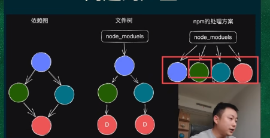
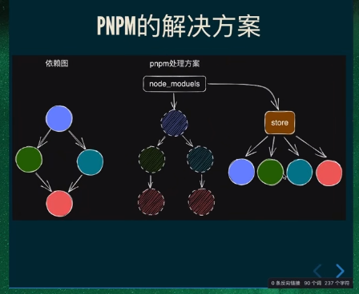

幻影依赖(幽灵依赖): 比如我们只安装了antd的库,但是antd的库安装了lodash,我们就可以代码中直接引入lodash,但是这样会造成问题,升级antd后可能有lodash版本问题,不好排除bug   
根本原因: 是因为npm的依赖是一个树型结构,相同的依赖会重复引用(D),以下图:  
  
解决方法pnpm,pnpm 使用硬链接和符号链接来共享依赖项，从而显著减少了磁盘空间的使用,来解决幻影依赖(幽灵依赖)问题:   
