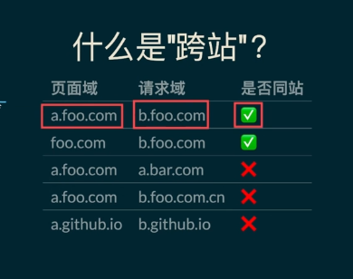

SameSite的作用是用于限制跨站(域名)请求,SameSite 是一种用于防止跨站请求伪造（CSRF）攻击的 Cookie 属性。它可以设置为三个值：None、Lax 和 Strict。  
  
SameSite的限制策略
| 属性      | 备注      | 注意事项     |
|---------|---------|--------|
| node | 不做任何限制 | 使用该值必须保证cookie为Secure,就是需要用https来进行传输 |
| Lax(默认值) | 阻止所有的发送cookie,但对超链接放行 | ``该A站点会携带Cookie到B站点 |
| Strict | 阻止发送cookie |  |

站点域  
xxx.公共后缀  
www.a.io -->a.io  
www.github.io --> www.github.io  
github.io属于公共后缀,类似于com和cn,github.io是一个整体