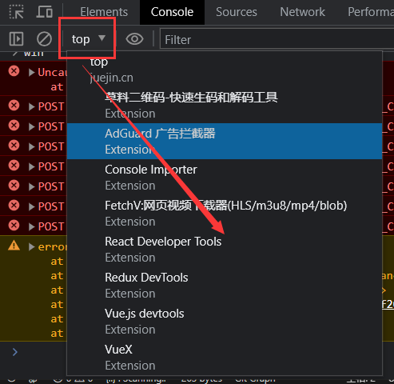
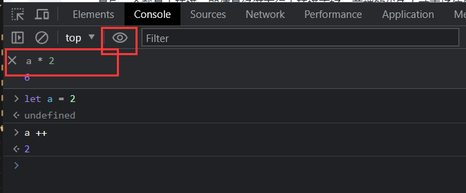

打印DOM的对象结构  
console.dir(doucment.body)  

计时  
console.time('loop')  
const start = Date.now()  
todo something 做一些耗时的操作  
console.timeEnd('loop')  

堆栈,可以查看公用函数是谁在调用  
console.trace()  

查看上下文
  
这里可以查看页面中如果包含了iframe,选了iframe后 window就是iframe了  

表达式  
  
方便调试  

