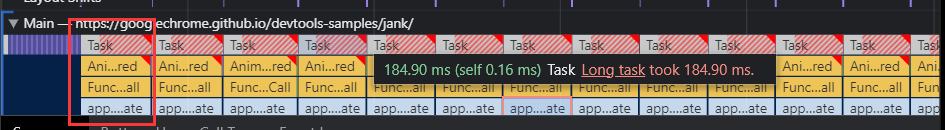
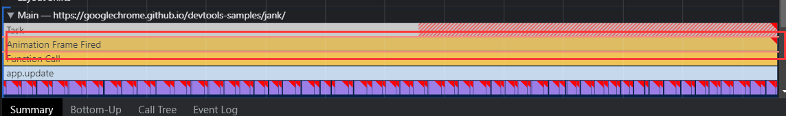

[演示地址](https://googlechrome.github.io/devtools-samples/jank/)  
一.多次点击add 10的按钮,直到页面明显卡顿  
二.打开开发者工具的performance选显卡,点击录制按钮,一般3s足够了:  
  
观察一下图片中第一个红框位置,如果出现红色,则表示出现了性能问题.红色部位的一节一节的代表从js执行到最终完成渲染这段时间,正常来说应该是一帧16.6ms,以下明显超过了这个值.  
红色下面的波形图有三种颜色  
  黄色: js的执行  
  紫色: 渲染的执行  
  绿色: 浏览器的绘制执行  

  

以下表示屏幕快照,勾选ScreenShots:  
  

以下的Main表示浏览器的渲染主线程:  
每一个方格(Task)表示一次事件循环(任务),一旦任务运行事件过长,则会在右上角显示一个红色的标记,这里横向表示有多少任务(Task),而纵向表示调用栈.  
单机图二的1标记处可以调整时间线,再次双击则可以取消  
  
以下是放大后的图:  
  
这里代表requestAnimationFrame.最后可以看出是app.update调用产生的性能问题,点击app.update,再点击最下面的call tree(执行树),得到以下图片:  
  
Recalculate Style: 重新计算样式消耗时间  
Layout: 布局消耗时间  
最后点击后面的app.js,浏览器会自动跳转到对应的出现性能问题的js  
  
最终原因是每次获取offsetTop代码导致了回流
